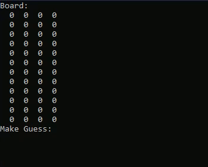

# mastermindGame
Play the classic Mastermind board game!

Mastermind is a one player code breaker game where there is a randomly generated 4-pin color combination. Your goal is to guess this code. After each guess, you receive hints based on accuracy of your guess.

A white peg means you have correctly guessed a color of the combiation but it is not in the correct spot

A black peg means that you have correctly guessed a color of the combination AND it is in the same spot.

By this definition, to win the game, you must achieve 4 black pins in 12 turns.

**THRILLING GAMEPLAY**

